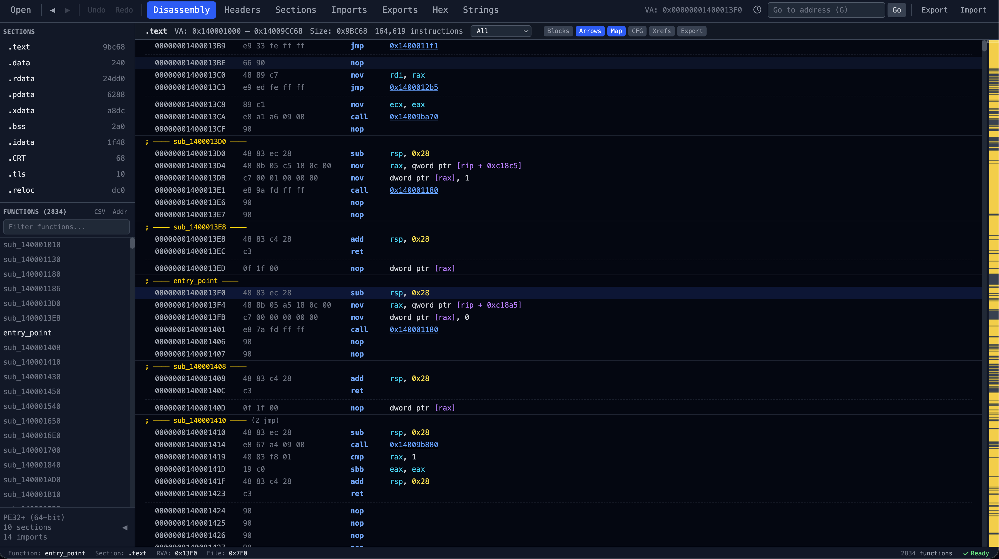

# Peek-a-Bin


Browser-based PE disassembler. All analysis client-side via WebAssembly.

[](https://github.com/wellingtonlee/peek-a-bin//actions/workflows/deploy.yml)



**[Live Demo](https://wellingtonlee.github.io/peek-a-bin/)**

## Features

**File Loading**
- Drag-and-drop PE files directly into the browser
- Bundled demo binary for quick exploration

**PE Analysis**
- DOS/NT/optional headers with field descriptions
- Section table with characteristics and entropy
- Import and export directory parsing
- Resource directory tree with version info, icon preview, and manifest display

**Disassembly**
- x86 and x64 disassembly via Capstone WASM
- Hybrid recursive descent + linear sweep disassembly
- Gap-fill regions visually dimmed to distinguish from control-flow-reachable code
- Virtual scrolling for large binaries
- Jump arrows showing control flow
- Minimap for navigation overview

**Advanced Analysis**
- Function detection via prologue scanning, call targets, and .pdata (x64 exception directory)
- Precise function boundaries from .pdata when available
- Cross-references (xrefs)
- Stack frame reconstruction
- Control flow graph (CFG) visualization

**Kernel Driver Analysis**
- Automatic detection of `.sys` drivers (NATIVE subsystem, WDM flag, kernel module imports)
- Dismissible amber banner and status bar badge for identified drivers
- Suspicious kernel API flagging with color-coded categories (Process/Thread, Callback/Hook, Memory, Registry, Filesystem, Network, Object)
- IOCTL code decoder — annotates device control codes inline in disassembly and decompiler output
- IRP dispatch table detection — identifies MajorFunction handler assignments in DriverEntry and auto-renames handler functions
- Authenticode / digital signature parsing — extracts signer subject, issuer, and validity dates from PKCS#7 SignedData without external ASN.1 libraries

**Navigation**
- Command palette (Ctrl/Cmd+P)
- Keyboard shortcuts panel (press `?`)
- Go-to-address
- Breadcrumb trail

**Annotations**
- Bookmarks, renaming, and comments
- Undo/redo support
- Persisted in localStorage
- Unified export/import (bookmarks, renames, comments, hex patches, functions)

**Data Views**
- Hex dump
- Strings extraction
- Data inspector
- Resource browser with download support

**Offline / PWA**
- Installable as a Progressive Web App
- Full offline support — all assets including the disassembly engine are cached

## Tech Stack

- React 19, TypeScript 5.7, Vite 6
- Tailwind CSS 4
- capstone-wasm (Capstone disassembly engine compiled to WASM)
- @tanstack/react-virtual (virtual scrolling)
- vite-plugin-pwa (service worker and offline caching)
- Vitest (unit testing)
- Web Workers for off-main-thread disassembly

## Prerequisites

- Node.js 20+
- npm

## Getting Started

```bash
git clone https://github.com/wellingtonlee/peek-a-bin.git
cd peek-a-bin
npm install
npm run dev
# http://localhost:5173/peek-a-bin/
```

## Testing

```bash
npm test          # run all tests once
npm run test:watch  # watch mode
```

## Production Build

```bash
npm run build
npm run preview  # http://localhost:4173/peek-a-bin/
```

## Offline / PWA Usage

Peek-a-Bin is a Progressive Web App that works fully offline after the first visit.

1. **Visit the app** in Chrome, Edge, or another PWA-capable browser (either the [live demo](https://wellingtonlee.github.io/peek-a-bin/) or a local `npm run preview` build).
2. **Install it** — click the install icon in the browser address bar, or use the browser menu (e.g. "Install Peek-a-Bin..." in Chrome). On mobile, use "Add to Home Screen".
3. **Use offline** — once installed, the app works without an internet connection. The service worker precaches all assets, including the ~2 MB Capstone WASM disassembly engine.
4. **Updates** — the service worker auto-updates in the background. On the next visit after an update is available, the new version loads automatically.

> **Note:** The PWA only caches the app itself. PE files you analyze are never uploaded or stored outside your browser — all processing is local.

## Docker

```bash
docker build -t peek-a-bin .
docker run -p 8080:80 peek-a-bin
# http://localhost:8080/peek-a-bin/
```

## Project Structure

```
src/
├── analysis/      # Binary analysis modules (driver detection, IOCTL, IRP)
├── components/    # React UI components
├── pe/            # PE file format parser (headers, imports, authenticode)
├── disasm/        # Disassembly engine integration
├── workers/       # Web Worker threads
├── hooks/         # Custom React hooks
├── utils/         # Shared utilities
├── styles/        # Tailwind and global styles
├── App.tsx        # Root application component
└── main.tsx       # Entry point
```

## Keyboard Shortcuts

Press `?` in the app to see all shortcuts. Key bindings include:

| Key | Action |
|-----|--------|
| `1`–`8` | Switch tabs |
| `G` | Go to address |
| `?` | Keyboard shortcuts panel |
| `Ctrl+P` | Command palette |
| `Ctrl+F` | Search disassembly |
| `B` | Toggle bookmark |
| `Ctrl+Z` / `Ctrl+Shift+Z` | Undo / Redo |
| `Alt+Left` / `Alt+Right` | Back / Forward |

## Architecture

Peek-a-Bin runs entirely client-side. Files are parsed in the browser using a TypeScript PE parser, then disassembled via Capstone compiled to WebAssembly running in a Web Worker. The WASM binary is cached in IndexedDB after first load. Application state is managed with React Context and `useReducer`. Virtual scrolling (via @tanstack/react-virtual) keeps the UI responsive even for large binaries.

Disassembly uses a hybrid approach: recursive descent from known entry points (exports, .pdata entries, detected prologues, call targets) followed by linear sweep to fill gaps. This avoids decoding embedded data as instructions while still providing full section coverage.

```
File Drop → PE Parser (TS) → Capstone WASM (Worker) → React UI
```

## License

[MIT](LICENSE)
