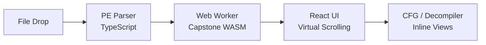
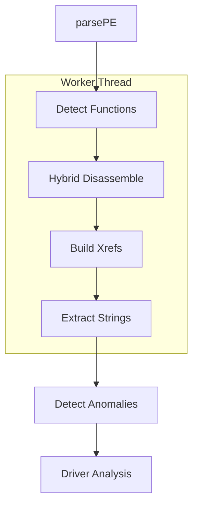

# Architecture

Peek-a-Bin runs entirely client-side. Files are parsed in the browser, disassembled via WebAssembly in a Web Worker, and rendered with React.

## High-Level Pipeline



## Analysis Pipeline



The pipeline is phased via `analysisPhase` state:
1. **Parse:** `parsePE()` reads headers, sections, imports, exports, resources, authenticode
2. **Detect:** Function detection via prologue scanning, call targets, `.pdata` exception directory
3. **Disassemble:** Hybrid recursive descent + linear sweep; gap-fill regions marked separately
4. **Xrefs:** Cross-references built for calls, jumps, strings, imports, and data sections
5. **Strings:** ASCII and UTF-16LE string extraction with address mapping
6. **Anomalies:** Security characteristic scanning (WX sections, packer indicators, etc.)
7. **Driver:** `.sys` driver detection (NATIVE subsystem, WDM flag, kernel imports)

## State Management

`useReducer` + React Context in `src/hooks/usePEFile.ts`.

- **`AppState`**: 33+ fields covering PE data, analysis results, UI state, annotations, AI state
- **`AppAction`**: Discriminated union with 48 action types
- **Access:** `useAppState()` for reading, `useAppDispatch()` for dispatching
- **Annotations:** Bookmarks, renames, comments auto-persist to localStorage per file with undo/redo via snapshot stack

## Worker Architecture

RPC-style communication in `src/workers/disasmClient.ts`:

- Heavy operations run off-thread: disassembly, function detection, xref building, decompilation
- Client caches results (disasm cache, xref cache, decompile cache)
- Transferable buffers for large arrays (don't hold references to transferred buffers)
- Capstone WASM is cached in IndexedDB (`peek-a-bin-wasm`) — first load fetches, subsequent loads read from cache

## Rendering

- **Virtual scrolling** via `@tanstack/react-virtual` — handles large binaries without DOM bloat
- **`DisplayRow`** union type: `label | insn | separator | data` — canonical definition in `useDisassemblyRows.ts`
- **`DisassemblyView`** + **`HexView`** are lazy-loaded
- **CSS grid** with `ch`-based column widths that scale with font size; 32-bit (10ch) and 64-bit (18ch) address columns

> **Note:** `JumpArrows.tsx` and `DisassemblyMinimap.tsx` have their own local `DisplayRow` types that must stay in sync with the canonical union.

## Control Flow Graph

- `buildCFG()` + `layoutCFG()` (dagre) in `src/disasm/cfg.ts`
- Inline IDA-style graph view toggled with `Space`
- Stays in graph mode across function changes; mode persisted to localStorage
- Sidebar graph overview with viewport rectangle
- Font-size responsive block dimensions

## Cross-Component Communication

Custom events for decoupled communication:

| Event | Purpose |
|-------|---------|
| `peek-a-bin:open-chat` | Open AI chat panel |
| `peek-a-bin:batch-rename` | Start batch auto-rename |
| `peek-a-bin:generate-report` | Generate AI report |
| `peek-a-bin:ai-scan` | Start vulnerability scan |
| `peek-a-bin:font-size-changed` | Font size setting changed |

Pattern: `window.dispatchEvent(new CustomEvent("peek-a-bin:<action>"))`

## localStorage Namespace

All keys use the `peek-a-bin:` prefix:

| Key | Description |
|-----|-------------|
| `peek-a-bin:llm-profiles` | AI provider profiles |
| `peek-a-bin:font-size` | Font size (10–16px) |
| `peek-a-bin:view-mode` | Linear or graph view mode |
| `peek-a-bin:theme-id` | Active theme ID |
| `peek-a-bin:custom-themes` | Custom theme definitions |
| `peek-a-bin:decompile-server` | Ghidra server settings |
| `peek-a-bin:chat:${fileName}` | AI chat messages per file |
| `peek-a-bin:chat-width` | Chat panel width |
| `peek-a-bin:report:${fileName}` | Cached AI report per file |

Per-file annotation keys are derived from the filename and stored automatically.

## Annotations & Export

- **Bookmarks, renames, comments** auto-persist to localStorage per file
- **Undo/redo** via snapshot stack
- **Export format:** `ExportSchemaV1` JSON with versioned schema for forward compatibility
  - Includes bookmarks, renames, comments, hex patches, detected functions
  - Filename: `{fileName}-analysis.json`

## Project Structure

```
src/
├── analysis/      # Binary analysis (driver detection, IOCTL, IRP, anomalies)
├── components/    # React UI components
├── decompile/     # Decompilation clients (Ghidra REST, WASM stub, types)
├── disasm/        # Disassembly engine + built-in decompiler
├── hooks/         # Custom React hooks (state, derived data, search)
├── llm/           # LLM integration (settings, streaming client, prompts)
├── mcp/           # MCP server (tools, resources, session, Capstone wrapper)
├── pe/            # PE file format parser (headers, imports, authenticode)
├── styles/        # Tailwind config + theme system
├── utils/         # Shared utilities (IndexedDB, export schema, entropy)
├── workers/       # Web Worker threads
├── App.tsx        # Root application component
└── main.tsx       # Entry point
ghidra-server/     # Optional Ghidra decompilation server (Docker + FastAPI)
```
