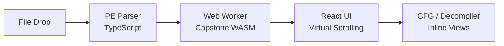
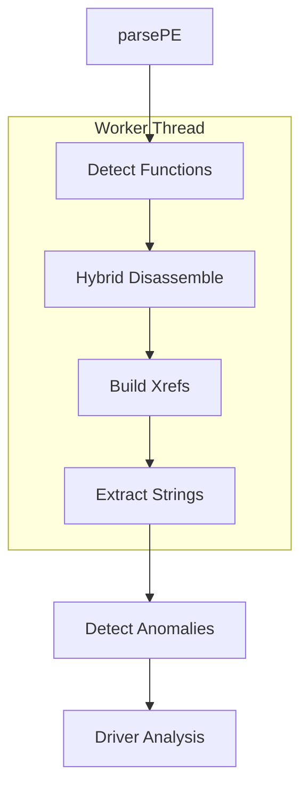

# Architecture

Peek-a-Bin runs entirely client-side. Files are parsed in the browser, disassembled via WebAssembly in a Web Worker, and rendered with React.

## High-Level Pipeline


```mermaid
flowchart LR
    A[File Drop] --> B[PE Parser<br/>TypeScript]
    B --> C[Web Worker<br/>Capstone WASM]
    C --> D[React UI<br/>Virtual Scrolling]
    D --> E[CFG / Decompiler<br/>Inline Views]
```

## Analysis Pipeline


```mermaid
flowchart TD
    A[parsePE] --> B[Detect Functions]
    B --> C[Hybrid Disassemble]
    C --> D[Build Xrefs]
    D --> E[Extract Strings]
    E --> F[Detect Anomalies]
    F --> G[Driver Analysis]

    subgraph Worker Thread
        B
        C
        D
        E
    end
```

The pipeline is phased via `analysisPhase` state:
1. **Parse:** `parsePE()` reads headers, sections, imports, exports, resources, authenticode
2. **Detect:** Function detection via `.pdata`, call targets, exports, unwind handlers and prologue scanning. **Where `.pdata` exists it is authoritative** — a prologue-pattern or padding-heuristic candidate strictly inside a `.pdata` range is dropped (t64: 511 → 279 functions, 232 overlapping pairs → 0). Jump-table case targets are case labels, not function starts. A pattern candidate strictly inside another candidate's matched bytes is suppressed too, since MSVC's hot-patch prologue table has entries that are prefixes of one another and every hot-patched function was being reported twice (t32 447 → 293 functions, 154 empty decompiled bodies → 0). The result carries `omitted` naming any decoder-fed pass that did not run — see [Target architecture](#target-architecture)
3. **Disassemble:** Hybrid recursive descent + linear sweep, seeded with jump-table case targets (`disasm/seeds.ts`); gap-fill regions marked separately
4. **Xrefs:** Cross-references built for calls, jumps, strings, imports, and data sections
5. **Strings:** ASCII and UTF-16LE string extraction with address mapping
6. **Anomalies:** Security characteristic scanning (WX sections, packer indicators, etc.)
7. **Driver:** `.sys` driver detection (NATIVE subsystem, WDM flag, kernel imports)

`AnalysisPhase` also has a terminal `"failed"` value. If any stage of the chain rejects, the
phase moves to `"failed"` and the status bar reports it, rather than leaving the UI pinned on
the last phase it reached. An exhausted Capstone decoder (`CapstoneUnavailableError`) reaches
the user through this path — see the decoder section below.

### Target architecture

The decoder is selected from `coffHeader.machine` via `archForMachine()` in
`src/disasm/arch.ts`, **not** from `is64`: `is64` is the PE32+ optional-header magic and is true
for ARM64 too, which is why an ARM64 image once parsed, listed its `.pdata` boundaries and
decoded to zero instructions.

`archForMachine()` returns `ImageArch = "x86" | "arm64" | "unsupported"`. `undefined` — "the
caller never told us" — yields `"x86"`, so a call site that has not been threaded through cannot
silently start decoding as something else, and cannot silently start *refusing* either.

| Arch | Disassembly | Decompiler / x86 xrefs / IRP detection |
|------|-------------|----------------------------------------|
| x86, x64 (I386, AMD64) | Hybrid recursive descent + gap fill (`functionDetect.ts`) | Supported |
| ARM64 (0xAA64) | Fixed-width linear sweep at 4-byte alignment (`arm64.ts`); function starts from evidence only — `.pdata` extents, exports, entry point, unwind handlers, and `bl` targets outside every extent. No prologue byte scan | **Declines** via `unsupportedOnArch()`. A64 branches and address idioms are read by `arm64Operands.ts` / `arm64Xref.ts` instead |
| Anything else — ARM32/Thumb, IA-64, RISC-V, MIPS | **Refuses.** See below | **Declines** via `unsupportedArchMessage()` |

A64 is fixed-width, so a linear sweep is not a heuristic — it is the decoding. Recursive
descent exists to resolve x86's ambiguous instruction boundaries and has nothing to do here.

#### Refusing an architecture

`"unsupported"` used to be `"x86"`, which meant an ARMNT image produced a screenful of
plausible x86 instructions that were pure fiction — and an x86 linear sweep decodes essentially
any byte string, so unlike the ARM64 case there is no coverage signal to notice it by. Capstone
itself is not the limit: the shipped WASM does contain `CS_ARCH_ARM` and both ARM and Thumb
decode through it. The engine around it is x86 — `pdata.ts` extracts extents for ARM64 and x64
only, and the prologue byte tables, the operand and xref grammars, the stack-frame analyser and
`cfg.ts`'s mnemonic tests are all x86 — and Thumb-2 is variable-length, so the linear sweep that
makes `arm64.ts` sound does not carry over. Decoding anyway would replace loud fiction with
quiet fiction.

The refusal is deliberately **asymmetric**, and the split is per stage rather than at load:

- **Throws** from `disassemble`, `hybridDisassemble`, `buildAllXrefs` and `decompileFunction`, whose entire output is instructions — an empty list there is indistinguishable from a correct answer.
- **Returns empty with `DetectResult.omitted` populated** from function detection, so headers, sections, imports, exports, resources, strings and Authenticode — format-level facts this tool reads correctly for any machine type — still reach the user. `FileSession.loadFile` guards its two throwing calls behind a `decodable` flag for the same reason.

In every dispatch the `"unsupported"` arm is tested **before** the `"arm64"` arm, because the
tail of that chain is the x86 path.

**ARM64EC and ARM64X carry machine 0xAA64 as well** and hold x64 code (EC) or both (X).
Distinguishing them properly needs the CHPE metadata pointer from the load-config directory,
which the parser does not read, so the evidence used is the bytes themselves: an A64 sweep
decodes 97.4% / 97.7% of the two real ARM64 binaries against 21.8–27.9% of four x86/x64 ones —
about a quarter of arbitrary x86 bytes decode as *something* in A64, which is exactly why the
failure was silent. `disassembleArm64` throws `Arm64DecodeRateError` below a 50% floor on
sections of 256 words or more, and `detectArm64Functions` catches it and degrades via `omitted`.
An ARM64X image, half of which is genuine A64, may sit above the floor.

#### `DetectResult.omitted`

Function detection is the one stage that keeps answering without a decoder, because its evidence
is mostly not made of instructions. What it returns is then *narrower* than usual, and nothing
said so — a decoder-less detection had the same shape as a complete one. `omitted:
DetectPass[]` names the passes that did not run (`"call-targets"`, `"jump-tables"`,
`"thunk-names"`, `"tail-calls"`) and is **empty when the answer is whole**. Only passes the
architecture actually has are ever listed: the ARM64 detector has no thunk or tail-call pass, so
their absence is a design decision rather than a degradation.

### The Capstone decoder is bounded, and must stay that way

capstone-wasm's linear memory is a fixed 16 MiB that cannot grow; its input is copied onto a
~65.6 KiB WASM stack, and `cs_disasm` allocates one contiguous `cs_insn[]` for the whole window.
Exceeding either kills the module *silently* — `disasm` throws when it decodes nothing, and scan
loops read a throw as "not code, skip a byte". A 4 MiB `.text` yielded **3.2%** of its
instructions with no error raised. `src/disasm/capstoneWindow.ts` owns every decode
(0x2000-byte windows, 2048 instructions per call, plus a liveness probe), and a source-scraping
guard in its test file fails the build if anything else in `src/` calls `.disasm(`.

### Performance envelope

Measured 2026-08-11 (node 18, i7-10710U, 2 cores). **Disassembly, not parsing, sets the
practical file-size ceiling:** roughly 1.2 s and 68 MiB of heap per MiB of `.text`, linear over
the range measured (up to 4 MiB of code). Extrapolating that fit — arithmetic, not a
measurement — puts the limit around 40–50 MiB of code before a browser tab is in trouble.

`parsePE()` itself is not the constraint, and its cost tracks **entry counts** rather than file
size, with `.pdata` and `.reloc` dominating: ~0.3 ms on a 100 KB real PE, ~27 ms on a synthetic
253 MiB image.

Caveat worth keeping: no large *real* PE exists on this machine — the largest is 273 KB — so
every large-image figure here comes from a synthetic PE with genuine structures and filler
`.text`. Both of the main-thread costs previously tracked here are now fixed: whole-file
checksum and entropy moved to the metrics worker (`peek-a-bin-7hg`; Headers+Sections 910 →
148 ms and the entropy strip 6569 → 101 ms on a 253 MiB image), and worker RPCs no longer
structured-clone the whole file (`peek-a-bin-7mf`; a file load's five calls 1868 → 706 ms). Both
sets of figures come from node's `structuredClone` and node timings, not from a browser.

### Export table

`parseExports()` in `src/pe/parser.ts` walks the **Export Address Table**, not the name table,
because the address table is the only one that covers exports with no name. Consequences, all
reflected in `ExportEntry` (`src/pe/types.ts`):

| Field | Meaning |
|-------|---------|
| `ordinal` | The spec ordinal: the export directory's **Ordinal Base** plus the address-table index. Not the raw index — a DLL with `Base = 5` exports ordinals 5, 6, 7… |
| `byOrdinal` | `true` for an export with no entry in the name table. These are given a synthesized `Ordinal#<n>` display name so they are visible rather than silently dropped |
| `forwarder` | `"OTHERDLL.Func"` when the export redirects elsewhere. Detected by the address falling inside the export directory's own RVA range, which means it points at a redirect string rather than at code in this image — so `address` is the RVA of that string, not of any code |

An address-table slot of zero marks an unused ordinal and is skipped, unless a name somehow
points at it (kept so a malformed file still shows its named exports).

## State Management

`useReducer` + React Context in `src/hooks/usePEFile.ts`.

- **`AppState`**: 45 fields covering PE data, analysis results, UI state, annotations, AI state
- **`AppAction`**: Discriminated union with 53 action types
- **Access:** `useAppState()` for reading, `useAppDispatch()` for dispatching
- **Annotations:** Bookmarks, renames, comments auto-persist to localStorage per file with undo/redo via snapshot stack

### `AIScanState`

The vulnerability scanner's progress and outcome live in `state.aiScan` (an `AIScanState`),
kept separate from the `aiScanResults` finding list so that three outcomes stay
distinguishable:

| `phase` | Meaning |
|---------|---------|
| `"idle"` | Never run for this binary |
| `"scanning"` | In flight; `scanned` / `failed` / `total` track progress |
| `"complete"` | Ran to completion — an empty finding list here genuinely means "nothing found" |
| `"failed"` | Ran but produced nothing usable |

An empty `aiScanResults` therefore means "clean" **only** when `phase` says the scan actually
completed. Collapsing the two is what made an unparseable model response render identically to
a clean binary. A run can also be partially successful: `phase: "complete"` with `failed > 0`
means some functions were scanned and others could not be, so the finding list is real but
incomplete. `error` retains the first failure message from the run.

## Worker Architecture

RPC-style communication in `src/workers/disasmClient.ts`:

- Heavy operations run off-thread: disassembly, function detection, xref building, decompilation
- Client caches results (disasm cache, xref cache, decompile cache)
- Capstone WASM is cached in IndexedDB (`peek-a-bin-wasm`) — first load fetches, subsequent loads read from cache

### Binary arguments: slice, then transfer

Structured clone of an `ArrayBufferView` serialises its whole backing `ArrayBuffer`, not the
view's window, and every large byte argument here is a view onto the *entire loaded file* — so a
4 KiB single-function `disassemble` used to copy 253 MiB. `send()` routes args through
`prepareBinaryArgs` (`src/workers/transfer.ts`), which replaces each **top-level** binary
argument with a private `slice()` of exactly that window and transfers it.

| Call (253 MiB file / 200 MiB `.text`) | Cloned view | Slice + transfer |
|---|---|---|
| `detectFunctions(.text)` | 182 ms | 76 ms |
| `disassemble(4 KiB function)` | 178 ms | ~0 ms |
| whole-buffer argument | 186 ms | 96 ms |

Two rules follow, and both are load-bearing:

- **It only ever transfers buffers it allocated itself.** Transferring detaches on the sender side, and the main thread keeps reading the file through `bufferRef`, `pe.buffer`, HexView, entropy and string extraction. A caller's view and its backing buffer are never in the transfer list — that invariant is what `__tests__/transfer.test.ts` pins, and it is why holding a reference to the file buffer is not merely allowed but normal.
- **The walk is top-level only.** An `Instruction[]` carries a tiny `bytes` view per element; transferring 500k of those measured **80.6 s against 1.6 s to clone**. Anything nested that genuinely needs to cross is flattened by its owner first — see `packDataWindows` / `unpackDataWindows` in `src/disasm/dataWindows.ts`, where every window is a view onto the whole file.

The last table row is the counter-intuitive one: slicing wins even when the copy is the same
size, because a clone costs roughly two passes where a slice costs one memcpy plus O(1)
ownership transfer. There is no size at which cloning is the better deal.

### Worker-side split

There are **two workers**. The disasm worker is three modules, split for testability:

| File | Holds |
|------|-------|
| `src/workers/disasm.worker.ts` | The worker shell — `self.onmessage`, the Capstone WASM bootstrap, and the IndexedDB module cache |
| `src/workers/dispatch.ts` | `dispatch(method, args, state)`, the RPC method switch, plus `WorkerMethod`, `WorkerRequest`, `WorkerState` and `createWorkerState()` |
| `src/workers/transfer.ts` | `prepareBinaryArgs` — the args walk described above |

`disasm.worker.ts` cannot be imported outside a worker: it touches `self` and `indexedDB` and
starts loading WASM at module-evaluation time. `dispatch.ts` touches none of those — the
Capstone handles reach it through `WorkerState`, already constructed — so it is importable
under Vitest's node environment and tested directly in
`src/workers/__tests__/dispatch.test.ts`. A guard in that suite asserts `dispatch.ts` never
references `capstone-wasm`, `self.`, `indexedDB` or `postMessage`, so the property cannot
silently regress.

> The `never`-exhaustiveness switch that `CLAUDE.md` lists among the seven the compiler
> protects moved with the dispatch: it now lives in the `default:` branch of `dispatch()` in
> `src/workers/dispatch.ts`, not in `disasm.worker.ts`. Adding a `WorkerMethod` member without
> handling it is still a compile error.

Worker state (`cs32`/`cs64`, the string/IAT/function/jump-table maps, `driverMode`, and the
cross-function `StructRegistry`) lives on a `WorkerState` object owned by the worker module
rather than in module-level `let` bindings, so the dispatch itself holds nothing between calls.

### The metrics worker

`metrics.worker.ts` / `metricsDispatch.ts` / `metricsClient.ts` is a **second, stateless**
worker handling whole-file checksum validation, per-section entropy and the hex entropy strip.

It is separate on purpose: the disasm worker services messages **serially**, so a checksum
posted to it queues behind a whole-image disassembly that can run for minutes. Before the split
these ran inside `useMemo`s, which cannot yield — on a synthetic 253 MiB PE that froze the UI
for ~140 ms (Headers), ~770 ms (Sections) and ~6.5 s (entropy strip, recomputed on every Hex tab
open whether or not the strip was ever shown). Measured after: Headers+Sections 910 → 148 ms,
entropy strip 6569 → 101 ms.

Inputs under the thresholds in `src/hooks/asyncMetricState.ts` — 256 KiB for the strip, 1 MiB
for file metrics — stay synchronous and spawn no worker, so an ordinary binary never shows a
loading state. `asyncMetricState.ts` also holds `asyncMetricReducer`, the pure state machine
behind `useFileMetrics`, kept as a leaf module because there is no React renderer here.

## Rendering

- **Virtual scrolling** via `@tanstack/react-virtual` — handles large binaries without DOM bloat
- **`DisplayRow`** union type: `label | insn | separator | data` — canonical definition in `useDisassemblyRows.ts`
- **`DisassemblyView`** + **`HexView`** are lazy-loaded
- **CSS grid** with `ch`-based column widths that scale with font size; 32-bit (10ch) and 64-bit (18ch) address columns

> **`DisplayRow` has exactly one declaration** — the exported union in `useDisassemblyRows.ts`.
> `JumpArrows.tsx` and `DisassemblyMinimap.tsx` used to keep private narrowed copies that had to
> be hand-synced; they now `import type` the canonical one. Do not reintroduce a local copy: a
> narrowed structural clone still accepts the canonical rows at the call site, so it drifts
> silently instead of failing the build.

`DisassemblyView.tsx` is ~1520 lines after being split into `DisassemblyRows.tsx`,
`DisassemblyToolbar.tsx`, `InsnContextMenu.tsx`, `hooks/useInsnContextMenu.ts`,
`hooks/useDisassemblyKeyboard.ts` and `hooks/useGraphSearch.ts`. `CFGView` takes 23 props, with
several of its former ones read from `AppState` via context. **None of this has ever been
rendered** — see the verification status section in `CLAUDE.md`.

## Control Flow Graph

- `buildCFG()` + `layoutCFG()` (dagre) in `src/disasm/cfg.ts`
- Inline IDA-style graph view toggled with `Space`
- Stays in graph mode across function changes; mode persisted to localStorage
- Sidebar graph overview with viewport rectangle
- Font-size responsive block dimensions

## Cross-Component Communication

Custom events for decoupled communication:

| Event | Purpose |
|-------|---------|
| `peek-a-bin:open-chat` | Open AI chat panel |
| `peek-a-bin:batch-rename` | Start batch auto-rename |
| `peek-a-bin:generate-report` | Generate AI report |
| `peek-a-bin:ai-scan` | Start vulnerability scan |
| `peek-a-bin:open-settings` | Open the settings modal (e.g. when no API key is configured) |
| `peek-a-bin:show-xrefs` | Open the xref panel filtered to an address |
| `peek-a-bin:font-size-changed` | Font size setting changed |
| `peek-a-bin:theme-changed` | Active theme changed |
| `peek-a-bin:profile-changed` | Active LLM profile changed |

Pattern: `window.dispatchEvent(new CustomEvent("peek-a-bin:<action>"))`

## localStorage Namespace

All keys use the `peek-a-bin:` prefix:

| Key | Description |
|-----|-------------|
| `peek-a-bin:llm-profiles` | AI provider profiles |
| `peek-a-bin:llm-settings` | Legacy single-profile key; migrated to `llm-profiles` on first load |
| `peek-a-bin:font-size` | Font size (10–16px) |
| `peek-a-bin:view-mode` | Linear or graph view mode |
| `peek-a-bin:theme-id` | Active theme ID |
| `peek-a-bin:custom-themes` | Custom theme definitions |
| `peek-a-bin:decompile-server` | Ghidra server settings |
| `peek-a-bin:chat:${fileName}` | AI chat messages per file |
| `peek-a-bin:chat-width` | Chat panel width |
| `peek-a-bin:report:${fileName}` | Cached AI report per file |
| `peek-a-bin:sidebar-width` | Sidebar width |
| `peek-a-bin:decompile-width` | Decompile panel width |
| `peek-a-bin:bottom-panel-height` | Tabbed bottom panel height |
| `peek-a-bin:sections-open` | Sidebar sections panel collapsed state |
| `peek-a-bin:callers-open` | Sidebar call graph panel collapsed state |
| `peek-a-bin:graph-overview-open` | Sidebar graph overview collapsed state |
| `peek-a-bin:scroll-sync` | Disassembly ↔ decompile scroll sync toggle |
| `peek-a-bin:show-bytes` | Raw bytes column visibility |

Per-file annotation keys are derived from the filename and stored automatically.

## Annotations & Export

- **Bookmarks, renames, comments** auto-persist to localStorage per file
- **Undo/redo** via snapshot stack
- **Export format:** `ExportSchemaV1` JSON with versioned schema for forward compatibility
  - Includes bookmarks, renames, comments, hex patches, detected functions
  - Filename: `{fileName}-analysis.json`

## Project Structure

```
src/
├── analysis/      # Binary analysis (driver detection, IOCTL, IRP, anomalies)
├── components/    # React UI components
├── disasm/        # Disassembly engine + built-in decompiler; capstoneWindow.ts (the only
│                 #   caller of the WASM decoder), arch.ts, arm64*.ts, seeds.ts, dataWindows.ts
├── ghidra/        # REST client for the optional Ghidra server (see ghidra-server/)
├── hooks/         # Custom React hooks (state, derived data, search) + pure leaf reducers
│                 #   (decompileTabsState.ts, asyncMetricState.ts) that tests can import
├── llm/           # LLM integration (model registry, settings, streaming client,
│                 #   prompts, retry/backoff/limiter, zod response validation)
├── mcp/           # MCP server (tools, resources, paths, session, Capstone wrapper)
├── pe/            # PE file format parser (headers, imports, exports, authenticode)
├── styles/        # Tailwind config + theme system
├── utils/         # Shared utilities (IndexedDB, export schema, entropy)
├── workers/       # Two workers: disasm (disasm.worker.ts + dispatch.ts + transfer.ts) and
│                 #   metrics (metrics.worker.ts + metricsDispatch.ts + metricsClient.ts)
├── App.tsx        # Root application component
└── main.tsx       # Entry point
build/             # Build-time modules imported by vite.config.ts (csp.ts + its test)
ghidra-server/     # Optional Ghidra decompilation server (Docker + FastAPI)
```
