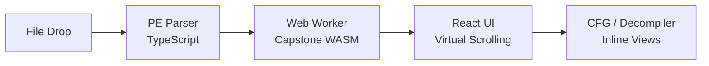
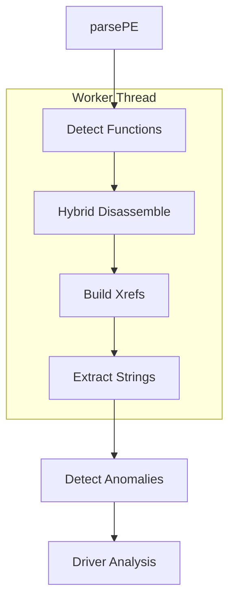

# Architecture

Peek-a-Bin runs entirely client-side. Files are parsed in the browser, disassembled via WebAssembly in a Web Worker, and rendered with React.

## High-Level Pipeline


```mermaid
flowchart LR
    A[File Drop] --> B[PE Parser<br/>TypeScript]
    B --> C[Web Worker<br/>Capstone WASM]
    C --> D[React UI<br/>Virtual Scrolling]
    D --> E[CFG / Decompiler<br/>Inline Views]
```

## Analysis Pipeline


```mermaid
flowchart TD
    A[parsePE] --> B[Detect Functions]
    B --> C[Hybrid Disassemble]
    C --> D[Build Xrefs]
    D --> E[Extract Strings]
    E --> F[Detect Anomalies]
    F --> G[Driver Analysis]

    subgraph Worker Thread
        B
        C
        D
        E
    end
```

The pipeline is phased via `analysisPhase` state:
1. **Parse:** `parsePE()` reads headers, sections, imports, exports, resources, authenticode
2. **Detect:** Function detection via prologue scanning, call targets, `.pdata` exception directory
3. **Disassemble:** Hybrid recursive descent + linear sweep; gap-fill regions marked separately
4. **Xrefs:** Cross-references built for calls, jumps, strings, imports, and data sections
5. **Strings:** ASCII and UTF-16LE string extraction with address mapping
6. **Anomalies:** Security characteristic scanning (WX sections, packer indicators, etc.)
7. **Driver:** `.sys` driver detection (NATIVE subsystem, WDM flag, kernel imports)

`AnalysisPhase` also has a terminal `"failed"` value. If any stage of the chain rejects, the
phase moves to `"failed"` and the status bar reports it, rather than leaving the UI pinned on
the last phase it reached.

### Export table

`parseExports()` in `src/pe/parser.ts` walks the **Export Address Table**, not the name table,
because the address table is the only one that covers exports with no name. Consequences, all
reflected in `ExportEntry` (`src/pe/types.ts`):

| Field | Meaning |
|-------|---------|
| `ordinal` | The spec ordinal: the export directory's **Ordinal Base** plus the address-table index. Not the raw index — a DLL with `Base = 5` exports ordinals 5, 6, 7… |
| `byOrdinal` | `true` for an export with no entry in the name table. These are given a synthesized `Ordinal#<n>` display name so they are visible rather than silently dropped |
| `forwarder` | `"OTHERDLL.Func"` when the export redirects elsewhere. Detected by the address falling inside the export directory's own RVA range, which means it points at a redirect string rather than at code in this image — so `address` is the RVA of that string, not of any code |

An address-table slot of zero marks an unused ordinal and is skipped, unless a name somehow
points at it (kept so a malformed file still shows its named exports).

## State Management

`useReducer` + React Context in `src/hooks/usePEFile.ts`.

- **`AppState`**: 32 fields covering PE data, analysis results, UI state, annotations, AI state
- **`AppAction`**: Discriminated union with 53 action types
- **Access:** `useAppState()` for reading, `useAppDispatch()` for dispatching
- **Annotations:** Bookmarks, renames, comments auto-persist to localStorage per file with undo/redo via snapshot stack

### `AIScanState`

The vulnerability scanner's progress and outcome live in `state.aiScan` (an `AIScanState`),
kept separate from the `aiScanResults` finding list so that three outcomes stay
distinguishable:

| `phase` | Meaning |
|---------|---------|
| `"idle"` | Never run for this binary |
| `"scanning"` | In flight; `scanned` / `failed` / `total` track progress |
| `"complete"` | Ran to completion — an empty finding list here genuinely means "nothing found" |
| `"failed"` | Ran but produced nothing usable |

An empty `aiScanResults` therefore means "clean" **only** when `phase` says the scan actually
completed. Collapsing the two is what made an unparseable model response render identically to
a clean binary. A run can also be partially successful: `phase: "complete"` with `failed > 0`
means some functions were scanned and others could not be, so the finding list is real but
incomplete. `error` retains the first failure message from the run.

## Worker Architecture

RPC-style communication in `src/workers/disasmClient.ts`:

- Heavy operations run off-thread: disassembly, function detection, xref building, decompilation
- Client caches results (disasm cache, xref cache, decompile cache)
- Transferable buffers for large arrays (don't hold references to transferred buffers)
- Capstone WASM is cached in IndexedDB (`peek-a-bin-wasm`) — first load fetches, subsequent loads read from cache

### Worker-side split

The worker is two modules, and the split exists for testability:

| File | Holds |
|------|-------|
| `src/workers/disasm.worker.ts` | The worker shell — `self.onmessage`, the Capstone WASM bootstrap, and the IndexedDB module cache |
| `src/workers/dispatch.ts` | `dispatch(method, args, state)`, the RPC method switch, plus `WorkerMethod`, `WorkerRequest`, `WorkerState` and `createWorkerState()` |

`disasm.worker.ts` cannot be imported outside a worker: it touches `self` and `indexedDB` and
starts loading WASM at module-evaluation time. `dispatch.ts` touches none of those — the
Capstone handles reach it through `WorkerState`, already constructed — so it is importable
under Vitest's node environment and tested directly in
`src/workers/__tests__/dispatch.test.ts`. A guard in that suite asserts `dispatch.ts` never
references `capstone-wasm`, `self.`, `indexedDB` or `postMessage`, so the property cannot
silently regress.

> The `never`-exhaustiveness switch that `CLAUDE.md` lists among the seven the compiler
> protects moved with the dispatch: it now lives in the `default:` branch of `dispatch()` in
> `src/workers/dispatch.ts`, not in `disasm.worker.ts`. Adding a `WorkerMethod` member without
> handling it is still a compile error.

Worker state (`cs32`/`cs64`, the string/IAT/function/jump-table maps, `driverMode`, and the
cross-function `StructRegistry`) lives on a `WorkerState` object owned by the worker module
rather than in module-level `let` bindings, so the dispatch itself holds nothing between calls.

## Rendering

- **Virtual scrolling** via `@tanstack/react-virtual` — handles large binaries without DOM bloat
- **`DisplayRow`** union type: `label | insn | separator | data` — canonical definition in `useDisassemblyRows.ts`
- **`DisassemblyView`** + **`HexView`** are lazy-loaded
- **CSS grid** with `ch`-based column widths that scale with font size; 32-bit (10ch) and 64-bit (18ch) address columns

> **Note:** `JumpArrows.tsx` and `DisassemblyMinimap.tsx` have their own local `DisplayRow` types that must stay in sync with the canonical union.

## Control Flow Graph

- `buildCFG()` + `layoutCFG()` (dagre) in `src/disasm/cfg.ts`
- Inline IDA-style graph view toggled with `Space`
- Stays in graph mode across function changes; mode persisted to localStorage
- Sidebar graph overview with viewport rectangle
- Font-size responsive block dimensions

## Cross-Component Communication

Custom events for decoupled communication:

| Event | Purpose |
|-------|---------|
| `peek-a-bin:open-chat` | Open AI chat panel |
| `peek-a-bin:batch-rename` | Start batch auto-rename |
| `peek-a-bin:generate-report` | Generate AI report |
| `peek-a-bin:ai-scan` | Start vulnerability scan |
| `peek-a-bin:open-settings` | Open the settings modal (e.g. when no API key is configured) |
| `peek-a-bin:show-xrefs` | Open the xref panel filtered to an address |
| `peek-a-bin:font-size-changed` | Font size setting changed |
| `peek-a-bin:theme-changed` | Active theme changed |
| `peek-a-bin:profile-changed` | Active LLM profile changed |

Pattern: `window.dispatchEvent(new CustomEvent("peek-a-bin:<action>"))`

## localStorage Namespace

All keys use the `peek-a-bin:` prefix:

| Key | Description |
|-----|-------------|
| `peek-a-bin:llm-profiles` | AI provider profiles |
| `peek-a-bin:llm-settings` | Legacy single-profile key; migrated to `llm-profiles` on first load |
| `peek-a-bin:font-size` | Font size (10–16px) |
| `peek-a-bin:view-mode` | Linear or graph view mode |
| `peek-a-bin:theme-id` | Active theme ID |
| `peek-a-bin:custom-themes` | Custom theme definitions |
| `peek-a-bin:decompile-server` | Ghidra server settings |
| `peek-a-bin:chat:${fileName}` | AI chat messages per file |
| `peek-a-bin:chat-width` | Chat panel width |
| `peek-a-bin:report:${fileName}` | Cached AI report per file |
| `peek-a-bin:sidebar-width` | Sidebar width |
| `peek-a-bin:decompile-width` | Decompile panel width |
| `peek-a-bin:bottom-panel-height` | Tabbed bottom panel height |
| `peek-a-bin:sections-open` | Sidebar sections panel collapsed state |
| `peek-a-bin:callers-open` | Sidebar call graph panel collapsed state |
| `peek-a-bin:graph-overview-open` | Sidebar graph overview collapsed state |
| `peek-a-bin:scroll-sync` | Disassembly ↔ decompile scroll sync toggle |
| `peek-a-bin:show-bytes` | Raw bytes column visibility |

Per-file annotation keys are derived from the filename and stored automatically.

## Annotations & Export

- **Bookmarks, renames, comments** auto-persist to localStorage per file
- **Undo/redo** via snapshot stack
- **Export format:** `ExportSchemaV1` JSON with versioned schema for forward compatibility
  - Includes bookmarks, renames, comments, hex patches, detected functions
  - Filename: `{fileName}-analysis.json`

## Project Structure

```
src/
├── analysis/      # Binary analysis (driver detection, IOCTL, IRP, anomalies)
├── components/    # React UI components
├── decompile/     # Decompilation clients (Ghidra REST, WASM stub, types)
├── disasm/        # Disassembly engine + built-in decompiler
├── hooks/         # Custom React hooks (state, derived data, search)
├── llm/           # LLM integration (model registry, settings, streaming client,
│                 #   prompts, retry/backoff/limiter, zod response validation)
├── mcp/           # MCP server (tools, resources, paths, session, Capstone wrapper)
├── pe/            # PE file format parser (headers, imports, exports, authenticode)
├── styles/        # Tailwind config + theme system
├── utils/         # Shared utilities (IndexedDB, export schema, entropy)
├── workers/       # Web Worker: worker shell (disasm.worker.ts) + RPC dispatch (dispatch.ts)
├── App.tsx        # Root application component
└── main.tsx       # Entry point
build/             # Build-time modules imported by vite.config.ts (csp.ts + its test)
ghidra-server/     # Optional Ghidra decompilation server (Docker + FastAPI)
```
