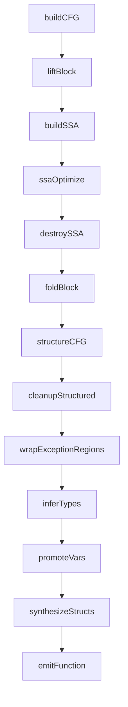

# Decompiler Internals

The built-in decompiler is an IR-based pipeline that transforms x86/x64 assembly into C-like pseudocode. Located in `src/disasm/decompile/` (~6,360 LOC across 16 code files + 5 test files).

## Pipeline

Entry point: `decompileFunction()` in `pipeline.ts`.

### Stage Details

| Stage | File | Description |
|-------|------|-------------|
| `buildCFG` | `cfg.ts` | Build control flow graph + detect loops from instructions |
| `liftBlock` | `lifter.ts` | Translate each basic block's instructions to IR statements |
| `buildSSA` | `ssa.ts` | Static Single Assignment: dominator tree, phi insertion, renaming |
| `ssaOptimize` | `ssaopt.ts` | SSA optimizations: const prop, copy prop, DCE, GVN, LICM |
| `destroySSA` | `ssadestroy.ts` | Lower phi nodes to copy statements |
| `foldBlock` | `fold.ts` | Constant folding, single-use inlining, expression simplification |
| `structureCFG` | `structure.ts` | Recover if/while/do-while/for/switch from CFG |
| `cleanupStructured` | `cleanup.ts` | Guard clause flattening, goto/empty-block elimination |
| `wrapExceptionRegions` | `pipeline.ts` | Wrap `__try/__except` from `.pdata` exception info |
| `inferTypes` | `typeInfer.ts` | Forward + backward type propagation |
| `promoteVars` | `promote.ts` | Stack slots → named local variables with types |
| `synthesizeStructs` | `structs.ts` | Detect struct access patterns, rewrite to field access |
| `emitFunction` | `emit.ts` | Emit C-like text + line map |

## IR System

Defined in `ir.ts`.

### IRExpr (13 kinds)

| Kind | Description |
|------|-------------|
| `const` | Numeric constant with size |
| `reg` | Register reference (with optional SSA version) |
| `var` | Named variable |
| `binary` | Binary operation (+, -, *, /, comparisons, logic) |
| `unary` | Unary operation (~, !, -) |
| `deref` | Memory dereference |
| `call` | Function call with arguments |
| `cast` | Type cast |
| `ternary` | Conditional expression |
| `field_access` | Struct field access (base->field) |
| `array_access` | Array element access (base[index]) |
| `unknown` | Unlifted/opaque expression |

### IRStmt (17 kinds)

| Kind | Description |
|------|-------------|
| `assign` | Variable/register assignment |
| `store` | Memory store |
| `call_stmt` | Void function call |
| `return` | Function return |
| `if` | Conditional with then/else bodies |
| `while` | While loop |
| `do_while` | Do-while loop |
| `for` | For loop (init, condition, update, body) |
| `switch` | Switch statement with cases + default |
| `goto` | Goto label |
| `label` | Label definition |
| `comment` | Comment |
| `raw` | Raw text passthrough |
| `break` | Loop break |
| `continue` | Loop continue |
| `phi` | SSA phi node |
| `try` | `__try/__except` exception handling |

## Adding New IRExpr Kinds

**All 6 files must be updated** — missing any walker causes silent data loss:

1. `ir.ts` — Add to `IRExpr` union type + `walkExpr` switch
2. `fold.ts` — `foldExpr`, `countReads`, `substituteReg`, `hasSideEffects`
3. `ssaopt.ts` — `replaceRegInExpr`, `countExprUses`, `hasSideEffects`
4. `promote.ts` — `promoteExpr`
5. `structs.ts` — `walkExprs`, `rewriteExpr`
6. `emit.ts` — `emitExpr`

## Adding New IRStmt Kinds

Update these 5 locations:

1. `ir.ts` — Add to `IRStmt` union type + `walkStmts` switch
2. `fold.ts` — `foldStmt`
3. `emit.ts` — `emitStmt`
4. `structure.ts` — Control flow handlers
5. `cleanup.ts` — Cleanup pass handlers

## SSA Pass

Cooper-Harvey-Kennedy dominator algorithm (`ssa.ts`):

- Pruned phi insertion with liveness
- Per-register versioning and renaming
- Natural loop detection via back-edge analysis

### SSA Optimizations (`ssaopt.ts`)

| Optimization | Description |
|-------------|-------------|
| Simplify phis | Remove trivial phi nodes |
| Copy propagation | Replace copies with source values |
| Constant propagation | Fold known constant values |
| Dead code elimination | Remove unused assignments |
| Global Value Numbering | Eliminate redundant subexpressions (commutative normalization) |
| Loop-Invariant Code Motion | Hoist invariant assignments to preheader |
| Induction variable recognition | Tag phi nodes with step metadata |

## Fold Rules (`fold.ts`)

Expression simplification rules applied after SSA destruction:

- Algebraic identities (`x + 0`, `x * 1`, `x & 0`, etc.)
- Div/mod simplification
- Comparison folding (const on right)
- Ternary simplification
- Sign-extend pattern: `(x << 24) >> 24` → `(int8_t)x`
- Strength reduction: `x * 2` → `x << 1`
- Double-cast removal (via `castTypeSize` regex helper)
- Negation absorption: `!(x == y)` → `x != y`
- De Morgan's law: `!(a && b)` → `!a || !b`
- Increment/decrement: `x = x + 1` → `x++`
- Redundant cast suppression via TypeContext

## Control Flow Structuring (`structure.ts`)

- **Short-circuit detection:** `a && b && c` chains (up to 8 blocks)
- **Multi-exit loop break:** Conditional branches outside loop → `if (cond) break`
- **Guard clause flattening:** `if (cond) { return } else { rest }` → `if (cond) { return } rest`
- **For-loop detection:** Scans all body blocks for increment patterns
- **Do-while with leading break:** Converted to `while` when body starts with break
- **Continue detection:** Goto-to-loop-header → `continue`

### Cleanup Pass (`cleanup.ts`)

Runs after `structureCFG`, before `inferTypes`:
- Guard clause flattening (single-level, not recursive inversion)
- Redundant goto elimination
- Empty block elimination

## Type System (`typeInfer.ts`)

`DecompType` lattice with 11 kinds:

| Kind | Description |
|------|-------------|
| `unknown` | Unresolved type |
| `int` | Integer (with signedness: signed/unsigned/unknown) |
| `float` | Floating-point |
| `ptr` | Pointer |
| `bool` | Boolean |
| `void` | Void |
| `struct` | Struct type |
| `array` | Array type |
| `handle` | Win32 HANDLE |
| `ntstatus` | NTSTATUS return value |
| `hresult` | COM HRESULT return value |

**`meetTypes()`** merges types: specific wins over unknown; handle/ntstatus/hresult win over int/ptr.

### Type Inference

- Forward + backward propagation
- Signed/unsigned inference from conditional comparisons, casts, deref patterns
- API-aware typing from ~130 Win32/NT function signatures

## API Signatures (`apitypes.ts`)

~130 Win32/NT API type signatures across categories:

- Memory: VirtualAlloc, HeapAlloc, LocalAlloc, etc.
- String: lstrcpy, MultiByteToWideChar, etc.
- File I/O: CreateFile, ReadFile, WriteFile, etc.
- Process/Thread: CreateProcess, CreateThread, etc.
- Synchronization: WaitForSingleObject, CreateMutex, etc.
- Exception: SetUnhandledExceptionFilter, RtlAddFunctionTable, etc.
- Crypto: CryptAcquireContext, CryptEncrypt, etc.
- COM: CoCreateInstance, CoInitializeEx, etc.
- NT/Zw: NtCreateFile, NtQuerySystemInformation, etc.
- Network: socket, connect, send, recv, etc.
- Device I/O: DeviceIoControl, NtDeviceIoControlFile, etc.

Use type shorthands (`PVOID`, `HANDLE_T`, `NTSTATUS_T`, etc.) for consistency.

## Struct Synthesis (`structs.ts`)

`StructRegistry` is cross-function state shared in the worker (don't clear between functions).

### Detection

`decomposeAddress()` breaks `base + idx * scale + offset` patterns:
- 2+ distinct offsets on same base → struct candidate
- Scale in {1, 2, 4, 8} without struct match → `IRArrayAccess`

### Features

- Fingerprint-based dedup and subset merging
- Field type inference (signedness from comparisons, pointer from derefs, float from XMM)
- Alias-aware base grouping
- Call-site parameter linking for cross-function struct propagation
- Typedef emission: `typedef struct { ... } struct_N;`
- `->fieldName` syntax in emitted pseudocode

## Emission (`emit.ts`)

- Module-level `_typeCtx`: set before emission, cleared after
- Enables cast suppression and type-aware idioms:
  - `INVALID_HANDLE_VALUE` for handle comparisons
  - `NT_SUCCESS(x)` for NTSTATUS checks
  - `SUCCEEDED(x)` / `FAILED(x)` for HRESULT checks
- Type-based variable naming: HANDLE → `hFile`, NTSTATUS → `status`, HRESULT → `hr`, PVOID → `pBuffer`, BOOL → `bResult`
- Increment/decrement emission: `x++` / `x--`

## Testing

- **Location:** `src/disasm/decompile/__tests__/`
- **Framework:** Vitest
- **Fixture builders:** `buildMinimalPE32()` / `buildMinimalPE64()` — programmatic PE buffer construction (no binary fixture files)
- **Coverage:** Fold rules (20+ tests), SSA optimizations, GVN, enum inference, LICM, exception handling

## Gotchas

- `fold.ts` has a `castTypeSize` helper using regex to extract bit width from type strings like `int32_t`
- `cleanup.ts` runs after `structureCFG`, before `inferTypes` — guard clause flattening is single-level only
- `StructRegistry` persists across decompilation calls in the worker — this is intentional for cross-function struct propagation
- All expression walkers must handle every `IRExpr` kind — missing cases cause silent data loss
