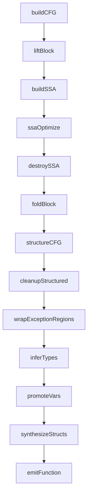

# Decompiler Internals

The built-in decompiler is an IR-based pipeline that transforms x86/x64 assembly into C-like pseudocode. Located in `src/disasm/decompile/` (~10,500 LOC across 16 code files, plus 15 test files in `__tests__/`).

It is an **x86 instruction grammar and nothing else.** Fed A64 it did not fail, it emitted
confident nonsense — a body of `/* unlifted: stp x19, x20, … */` with every branch dropped, a
fabricated local per ARM64 register and a closing `return rax`. Both the browser worker and the
MCP `decompile_function` tool now decline on an ARM64 image (`unsupportedOnArch` in
`src/disasm/arch.ts`) rather than guessing. Select on `coffHeader.machine`, never on `is64` —
an ARM64 PE is PE32+.

## Pipeline

```mermaid
flowchart TD
    A[buildCFG] --> B[liftBlock]
    B --> C[buildSSA]
    C --> D[ssaOptimize]
    D --> E[destroySSA]
    E --> F[foldBlock]
    F --> G[structureCFG]
    G --> H[cleanupStructured]
    H --> I[wrapExceptionRegions]
    I --> J[inferTypes]
    J --> K[promoteVars]
    K --> L[synthesizeStructs]
    L --> M[emitFunction]
```

Entry point: `decompileFunction()` in `pipeline.ts`.

### Stage Details

| Stage | File | Description |
|-------|------|-------------|
| `buildCFG` | `cfg.ts` | Build control flow graph + detect loops from instructions |
| `liftBlock` | `lifter.ts` | Translate each basic block's instructions to IR statements |
| `buildSSA` | `ssa.ts` | Static Single Assignment: dominator tree, phi insertion, renaming |
| `ssaOptimize` | `ssaopt.ts` | SSA optimizations: const prop, copy prop, DCE, GVN, LICM |
| `destroySSA` | `ssadestroy.ts` | Lower phi nodes to copy statements |
| `foldBlock` | `fold.ts` | Constant folding, single-use inlining, expression simplification |
| `structureCFG` | `structure.ts` | Recover if/while/do-while/for/switch from CFG |
| `cleanupStructured` | `cleanup.ts` | Guard clause flattening, goto/empty-block elimination |
| `wrapExceptionRegions` | `pipeline.ts` | Wrap `__try/__except` from `.pdata` exception info |
| `inferTypes` | `typeInfer.ts` | Forward + backward type propagation |
| `promoteVars` | `promote.ts` | Stack slots → named local variables with types |
| `synthesizeStructs` | `structs.ts` | Detect struct access patterns, rewrite to field access |
| `emitFunction` | `emit.ts` | Emit C-like text + line map |

## IR System

Defined in `ir.ts`.

### IRExpr (12 kinds)

| Kind | Description |
|------|-------------|
| `const` | Numeric constant with size |
| `reg` | Register reference (with optional SSA version) |
| `var` | Named variable |
| `binary` | Binary operation (+, -, *, /, comparisons, logic) |
| `unary` | Unary operation (~, !, -) |
| `deref` | Memory dereference |
| `call` | Function call with arguments |
| `cast` | Type cast |
| `ternary` | Conditional expression |
| `field_access` | Struct field access (base->field) |
| `array_access` | Array element access (base[index]) |
| `unknown` | Unlifted/opaque expression |

### IRStmt (17 kinds)

| Kind | Description |
|------|-------------|
| `assign` | Variable/register assignment |
| `store` | Memory store |
| `call_stmt` | Void function call |
| `return` | Function return |
| `if` | Conditional with then/else bodies |
| `while` | While loop |
| `do_while` | Do-while loop |
| `for` | For loop (init, condition, update, body) |
| `switch` | Switch statement with cases + default |
| `goto` | Goto label |
| `label` | Label definition |
| `comment` | Comment |
| `raw` | Raw text passthrough |
| `break` | Loop break |
| `continue` | Loop continue |
| `phi` | SSA phi node |
| `try` | `__try/__except` exception handling |

## Adding New IRExpr / IRStmt Kinds

Roughly 30 switches across the pipeline dispatch on `expr.kind` / `stmt.kind`. Missing one does
not throw — it silently drops the expression from the output, which is why this checklist
matters. The switches fall into three groups.

### 1. The compiler catches these

Seven switches end in a `const _exhaustive: never = …` binding, so a new union member is a
build error until it is handled. `npm run typecheck` finds them for you:

| File | Functions |
|------|-----------|
| `ssa.ts` | `renameExpr` / `renameStmt` (nested in `renameVariables`) |
| `ssadestroy.ts` | `stripVersionsExpr` / `stripVersionsStmt` |
| `emit.ts` | `emitExpr` / `emitStmt` |
| `fold.ts` | `hasSideEffects` — one exported definition, imported by `ssaopt.ts`. It was previously two independent if-chains, both of which omitted `cast`, so `rbx = (int64_t)GetLastError()` read as pure and DCE deleted the call with the assignment |
| `workers/dispatch.ts` | RPC method dispatch — guards `WorkerMethod`, not IR, but same pattern |

### 2. Silent `default:` fallback — update by hand

| File | Functions |
|------|-----------|
| `fold.ts` | `foldStmt`, `countReads`, `countReadsInStmt`, `substituteReg`, `substituteRegInStmt` |
| `ssaopt.ts` | `replaceRegInExpr`, `replaceRegInStmt` |
| `structs.ts` | `exprKey`, `rewriteExpr`, `rewriteStmt` |
| `promote.ts` | `renameVarsInExpr`, `renameVarsInStmt`, `promoteExpr`, `promoteStmt` |
| `cleanup.ts` | `cleanupStmt` |

### 3. No `default:` and no exhaustiveness check — the worst case

Control falls off the end of the switch, so the new kind vanishes with no fallback branch and
no compile error:

| File | Functions |
|------|-----------|
| `ir.ts` | `walkExpr`, `walkStmts` |
| `ssaopt.ts` | `canonicalizeExpr`, the stmt walker in `deadCodeElimination`, the LICM expr walker |
| `structs.ts` | `walkExprs` and the stmt walker in `collectAccessPatterns` (both nested) |

### Not switches

`foldExpr` (`fold.ts`) and `countExprUses` (nested in `ssaopt.ts`'s `deadCodeElimination`) are
if-chains on `expr.kind`. Grep the function name rather than looking for `case`.

New `IRStmt` kinds additionally need control flow handling in `structure.ts`, and
`typeInfer.ts`'s `parseCastType` matters only if the kind gets a cast spelling.

> Extending `IRExpr` also means extending `DisplayRow` consumers if the kind surfaces in the UI.
> `DisplayRow` has exactly one declaration — the exported union in `useDisassemblyRows.ts` — and
> consumers `import type` it; do not reintroduce a narrowed local copy.

## SSA Pass

Cooper-Harvey-Kennedy dominator algorithm (`ssa.ts`):

- Pruned phi insertion with liveness
- Per-register versioning and renaming. **Version 0 is reserved for a register's function-entry value; the definition counter starts at 1.** When both meant 0, `ssaopt`'s `sameReg`/`regKey` treated the incoming value and the first definition as one value, and every SSA pass propagated across the two (`peek-a-bin-swi`)
- `detectNaturalLoops` — an edge `u → v` is a back edge only when `v` dominates `u`. This is the tree's **single** notion of "loop": `cfg.ts`'s `detectLoops` delegates to it and repackages the result as `Loop[]`, so the disassembly view's loop markers and the decompiler's loops can no longer disagree

### SSA Optimizations (`ssaopt.ts`)

| Optimization | Description |
|-------------|-------------|
| Simplify phis | Remove trivial phi nodes |
| Copy propagation | Replace copies with source values |
| Constant propagation | Fold known constant values |
| Dead code elimination | Remove unused assignments |
| Global Value Numbering | Eliminate redundant subexpressions (commutative normalization) |
| Loop-Invariant Code Motion | Hoist invariant assignments to preheader |
| Induction variable recognition | Tag phi nodes with step metadata |

## Fold Rules (`fold.ts`)

Expression simplification rules applied after SSA destruction:

- Algebraic identities (`x + 0`, `x * 1`, `x & 0`, etc.)
- Div/mod simplification
- Comparison folding (const on right)
- Ternary simplification
- Sign-extend pattern: `(x << 24) >> 24` → `(int8_t)x`
- Strength reduction: `x * 2` → `x << 1`
- Double-cast removal (via `castTypeSize` regex helper)
- Negation absorption: `!(x == y)` → `x != y`
- De Morgan's law: `!(a && b)` → `!a || !b`
- Increment/decrement: `x = x + 1` → `x++`
- Redundant cast suppression via TypeContext

## Control Flow Structuring (`structure.ts`)

- **Short-circuit detection:** `a && b && c` chains (up to 8 blocks)
- **Multi-exit loop break:** Conditional branches outside loop → `if (cond) break`
- **Guard clause flattening:** `if (cond) { return } else { rest }` → `if (cond) { return } rest`
- **For-loop detection:** Scans all body blocks for increment patterns
- **Do-while with leading break:** Converted to `while` when body starts with break
- **Continue detection:** Goto-to-loop-header → `continue`
- **Switch recovery:** the case-selecting register the table is indexed by is the primary reading of the switch subject — it selects the case by construction — with a `cmp`/`jcc` bounds check kept as corroboration. When the two name the same register the comparison's spelling wins and brings the default target with it; when they disagree the index register is emitted. The inverted-sense form (`jb table`) yields no default, because its fallthrough is the out-of-range code

### What real compiler output did to structuring

Driving three MSVC PEs through the pipeline headlessly on 2026-08-11 found that structuring was
the weakest part of the decompiler, and most of it has since been rebuilt. What was wrong, and
what the shape of the mistake was, is worth keeping — every one of these produced **valid C
stating something the machine does not do**, and every one was invisible to stage-level tests:

| Was | Now |
|-----|-----|
| `detectLoops` approximated back edges with BFS layers from the entry, so the merge block of every `if`-without-`else` became a loop header — ~86% of loops reported on real binaries did not exist, and the mis-structuring **deleted guards** | Delegates to the dominance-based `detectNaturalLoops`; false headers 5883/6308 → 2/3/2 per binary, with no genuine loop lost (`peek-a-bin-lrs`) |
| A triangle's branch target *is* the shared tail, so the "one arm ends in `ret`" shortcut structured it as an empty `then` and discarded the guard | An `if` closes at the immediate post-dominator (`computePostDominators`), and both early-return shortcuts refuse to fire on the convergence point. Statement drop 5.9–6.8% → 0.05–1.4%. `peek-a-bin-cb2` is still **open** for the residue |
| `for` and `do/while` bodies were a flat re-listing of the loop's blocks in block-id order, so both arms of an inner `if` ran unconditionally | The structured body is used; statement loss by object identity went to 0 and then to 4/8/8 per binary as loop work landed (`peek-a-bin-42l`, `peek-a-bin-b37`) |
| Loop guards were taken from conditionals that decide something *within* an iteration, or from a header that does work as well as testing | 34 wrong guards → 0, loop counts per binary unchanged — only the spelling moved (`peek-a-bin-jlo`, `peek-a-bin-bhh`) |
| Every emitted `goto` dangled — no label was ever written, and 405 of 553 targets left no emitted line to anchor one to | `structure.ts` emits an `IRLabel` in front of every block it walks and sweeps the unreferenced ones at the end: dangling gotos 392 → 0 (`peek-a-bin-uzi`) |
| `structureSwitch` was dead code on real input: case targets were registered as function starts, so the indirect-jmp block had zero successors | Case targets are case labels; t32 emits 4 switches / 20 case labels where it emitted 0 (`peek-a-bin-jy4`) |

A diamond is immune to the loop mistake and a triangle is not, which is why hand-written
fixtures passed for the project's whole history. **Judge any change here on emitted C via
`pipeline.test.ts`**, never on IR nodes; loop guards spelled as `for` or `do/while` still escape
the strict polarity audit (`peek-a-bin-8r0`).

### Cleanup Pass (`cleanup.ts`)

Runs after `structureCFG`, before `inferTypes`:
- Guard clause flattening (single-level, not recursive inversion)
- Redundant goto elimination
- Empty block elimination

## Type System (`typeInfer.ts`)

`DecompType` lattice with 12 kinds:

| Kind | Description |
|------|-------------|
| `unknown` | Unresolved type |
| `int` | Integer (with signedness: signed/unsigned/unknown) |
| `float` | Floating-point |
| `ptr` | Pointer |
| `bool` | Boolean |
| `void` | Void |
| `struct` | Struct type |
| `array` | Array type |
| `handle` | Win32 HANDLE |
| `ntstatus` | NTSTATUS return value |
| `hresult` | COM HRESULT return value |
| `enum` | Synthesized enum — carries a name and a `Map<number, string>` of members, inferred from switches with 3+ cases |

**`meetTypes()`** merges types: specific wins over unknown; handle/ntstatus/hresult win over int/ptr.

### Type Inference

- Forward + backward propagation
- Signed/unsigned inference from conditional comparisons, casts, deref patterns
- API-aware typing from ~130 Win32/NT function signatures

## API Signatures (`apitypes.ts`)

~130 Win32/NT API type signatures across categories:

- Memory: VirtualAlloc, HeapAlloc, LocalAlloc, etc.
- String: lstrcpy, MultiByteToWideChar, etc.
- File I/O: CreateFile, ReadFile, WriteFile, etc.
- Process/Thread: CreateProcess, CreateThread, etc.
- Synchronization: WaitForSingleObject, CreateMutex, etc.
- Exception: SetUnhandledExceptionFilter, RtlAddFunctionTable, etc.
- Crypto: CryptAcquireContext, CryptEncrypt, etc.
- COM: CoCreateInstance, CoInitializeEx, etc.
- NT/Zw: NtCreateFile, NtQuerySystemInformation, etc.
- Network: socket, connect, send, recv, etc.
- Device I/O: DeviceIoControl, NtDeviceIoControlFile, etc.

Use type shorthands (`PVOID`, `HANDLE_T`, `NTSTATUS_T`, etc.) for consistency.

## Struct Synthesis (`structs.ts`)

`StructRegistry` is cross-function state shared in the worker (don't clear between functions).

### Detection

`decomposeAddress()` breaks `base + idx * scale + offset` patterns:
- 2+ distinct offsets on same base → struct candidate
- Scale in {1, 2, 4, 8} without struct match → `IRArrayAccess`

### Features

- Fingerprint-based dedup and subset merging (subset merges need 3+ fields and no overlapping extents; a call-site *provenance* match may ignore the field-count guard but never the boundary conflict)
- Field type inference (signedness from comparisons, pointer from derefs, float from XMM), refined through `meetTypes()` rather than overwritten, and consulting `apitypes.ts` first
- Alias-aware base grouping. A verified frame base is **excluded** — two offsets off a frame pointer are two stack slots, not two fields
- Call-site parameter linking for cross-function struct propagation
- Nested struct detection: a field whose loaded value is used as a struct base is declared `struct_N*`, and typedef collection follows those references transitively
- **Emission is forward-declared tag form plus `#pragma pack(push, 1)` and explicit `_pad_0xNN` members** — the field names record recovered offsets, so a declaration C would not lay out that way states something false. Verified by compiling and running an `offsetof` probe: 145/145 definitions and 819/819 fields, from 18/149 and 318/852. Forward declarations rather than a topological sort, because synthesis produces cycles (a linked-list node) and `typedefs` only snapshots the structs one function touched
- `->fieldName` syntax in emitted pseudocode; a register base is spelled as a cast at the point of use (`((struct_0 *)rcx)->field_0x18`), never as a `struct_0 *rcx;` declaration — 59 of 151 such functions also do byte arithmetic on that register, which a pointer declaration would silently scale by `sizeof(struct_0)`

## Emission (`emit.ts`)

- Module-level `_typeCtx`: set before emission, cleared after
- Enables cast suppression and type-aware idioms:
  - `INVALID_HANDLE_VALUE` for handle comparisons
  - `NT_SUCCESS(x)` for NTSTATUS checks
  - `SUCCEEDED(x)` / `FAILED(x)` for HRESULT checks
- Type-based variable naming: HANDLE → `hFile`, NTSTATUS → `status`, HRESULT → `hr`, PVOID → `pBuffer`, BOOL → `bResult`
- Increment/decrement emission: `x++` / `x--`

## Testing

**`__tests__/pipeline.test.ts` is the one that matters.** It is the only end-to-end suite:
instructions in, emitted C out. `decompileFunction` takes `Instruction[]` rather than bytes, so
it needs neither Capstone nor a worker, and hand-writing the instruction stream makes the
intended semantics explicit instead of trusting a disassembler to agree. **If a change could
alter emitted output, add a case there.**

This is not a style preference. The inverted-condition bug sat in `structureCFG` for the
project's entire history while *every stage-level test agreed with it*, because they asserted on
the IR the buggy code produced — only the emitted text showed it. The same is true of the flat
loop bodies, the fabricated loops and the struct layouts: an assertion on an IR node is weaker
evidence and can agree with a bug. Struct work is asserted against the emitted `typedef struct`
block for exactly this reason.

- **Location:** `src/disasm/decompile/__tests__/`
- **Framework:** Vitest
- **Fixture builders:** `buildMinimalPE32()` / `buildMinimalPE64()` — programmatic PE buffer construction (no binary fixture files)
- **Coverage:** Fold rules, SSA construction and optimization, dominator/loop analysis, GVN, enum inference, LICM, emission, exception handling, API signatures, register state, struct synthesis, CFG patterns
- **Run:** `npm test` (or `npm run test:coverage`, which currently fails — `@vitest/coverage-v8` is not installed). Test counts are deliberately not quoted here — they go stale fast.

Beyond the suite, decompiler output has an external oracle: `gcc -std=gnu89 -fsyntax-only` over
every emitted function of three real MSVC binaries, currently **996 of 1001 clean**. Note that
277 of those 1001 contain an admitted `__unrecovered_N` or `/* unlifted: … */` — compiling is
not the same as recovering.

## Gotchas

- `fold.ts` has a `castTypeSize` helper using regex to extract bit width from type strings like `int32_t`
- `cleanup.ts` runs after `structureCFG`, before `inferTypes` — guard clause flattening is single-level only
- `StructRegistry` persists across decompilation calls in the worker — this is intentional for cross-function struct propagation
- All expression walkers must handle every `IRExpr` kind — missing cases cause silent data loss
